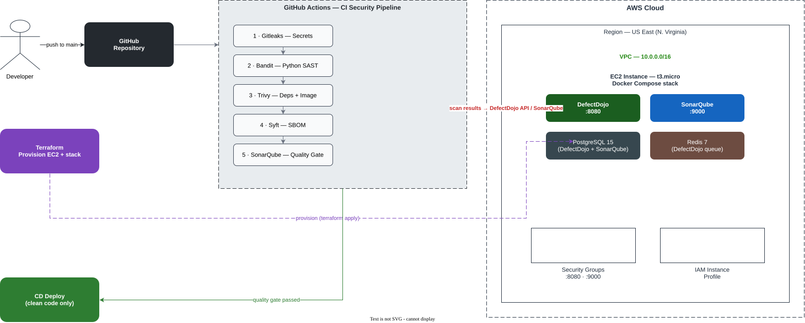

# Secure Pipeline

[](https://github.com/wazaglo/secure-pipeline/actions/workflows/ci-security.yml)
[](https://github.com/wazaglo/secure-pipeline/actions/workflows/gitleaks.yml)
[](LICENSE)

> **Author: Wisdom Azaglo**

A **security-first CI/CD pipeline** that scans every push to `main` and blocks code that contains secrets or vulnerabilities — then aggregates everything into **DefectDojo** and **SonarQube** running on a single **AWS EC2** instance provisioned by **Terraform**.

```
Push code → GitHub Actions CI → Gitleaks → Bandit → Trivy → Syft → SonarQube
                                     ↓
                     DefectDojo + SonarQube (AWS EC2, Terraform)
```

Want to see what happens *after* it ships? The pipeline is monitored end-to-end by the companion project, **[monitor-secure-pipeline](https://github.com/wazaglo/monitor-secure-pipeline)** — a Grafana + Prometheus + Loki + Tempo observability platform.

---

## Architecture



**Walkthrough:**
1. A developer pushes to `main` (or opens a PR).
2. **GitHub Actions** runs five security stages: Gitleaks (secrets) → Bandit (Python SAST) → Trivy (dependencies + container image) → Syft (SBOM) → SonarQube (code quality).
3. Every stage that produces a report uploads it to **DefectDojo** (`:8080`) via its API, so all findings live in one dashboard. SonarQube (`:9000`) runs the quality gate.
4. The dashboards run inside **Docker Compose** on a single **EC2 `t3.micro`** in a VPC, fronted by security groups and an IAM instance profile — all provisioned by **Terraform**.
5. Only clean code passes the quality gate and reaches **CD deploy**.
6. The dedicated **Gitleaks Secrets Gate** workflow (separate from the reporting pipeline) **fails the build on any leak** — secrets can never merge.

> 📐 **Diagram source:** edit [`docs/architecture.drawio`](docs/architecture.drawio) in [draw.io](https://app.diagrams.net) (real AWS icon set). Render to SVG/PNG headlessly with:
> ```bash
> docker run -w /data -v $(pwd)/docs:/data rlespinasse/drawio-desktop-headless -x -f svg architecture.drawio
> ```

---

## Prerequisites

- **AWS account** — the Terraform script provisions a single EC2 instance (free-tier eligible, `t3.micro`)
- **Terraform** installed (v1.3+)
- **SSH key pair** — you'll need your public key ready for `terraform.tfvars`
- **A GitHub repo** for this code (CI runs on push)

---

## Getting Started

### 1. Provision EC2

```bash
cd terraform

# Copy the example and edit with your values
cp terraform.tfvars.example terraform.tfvars
vim terraform.tfvars

terraform init
terraform apply
```

After apply, Terraform outputs:

```
defectdojo_url = http://54.123.45.67:8080
sonarqube_url  = http://54.123.45.67:9000
```

### 2. Get the DefectDojo API Key

SSH into the EC2 and read the credentials file the bootstrap created:

```bash
ssh -i /path/to/your-key.pem ubuntu@<PUBLIC_IP>
cat /opt/secure-pipeline/defectdojo-creds.txt
```

This will show:

```
DD_URL=http://54.123.45.67:8080
DD_API_KEY=<token>
DD_PRODUCT_ID=1
DD_ENGAGEMENT_ID=1
```

### 3. Set GitHub Secrets

Go to your repo → **Settings → Secrets and variables → Actions → New repository secret**

| Secret | Value |
|--------|-------|
| `DD_URL` | `http://<EC2_PUBLIC_IP>:8080` (from terraform output) |
| `DD_API_KEY` | From `/opt/secure-pipeline/defectdojo-creds.txt` on EC2 |
| `DD_PRODUCT_ID` | `1` (from file) |
| `DD_ENGAGEMENT_ID` | `1` (from file) |
| `SONAR_HOST_URL` | `http://<EC2_PUBLIC_IP>:9000` |
| `SONAR_TOKEN` | Generate in SonarQube UI: Login → My Account → Security → Generate Tokens |

### 4. Push Code

Push to `main` — the CI pipeline runs automatically and uploads results to your EC2 DefectDojo.

---

## Run Locally (no AWS)

You don't need EC2 to try the pipeline itself. Run the DefectDojo + SonarQube stack locally:

```bash
cp .env.example .env      # fill in your values
docker compose up -d
```

DefectDojo → `http://localhost:8080` · SonarQube → `http://localhost:9000`

> Default credentials are set in your `.env` / bootstrap. **SonarQube's initial default login is `admin` / `admin`** (you'll be prompted to change it on first login — it is *not* `admin123`).

---

## CI Pipeline

| Stage | Tool | What it finds |
|---|---|---|
| 1 | Gitleaks | Hardcoded secrets, API keys, passwords |
| 2 | Bandit | Python security bugs (eval, injection, unsafe calls) |
| 3 | Trivy FS | Vulnerable dependencies, misconfigurations |
| 4 | Docker Build | Builds container image |
| 5 | Trivy Image | OS-level CVEs in container layers |
| 6 | Syft SBOM | CycloneDX software bill of materials |
| 7 | SonarQube | Code quality bugs, security hotspots |
| 8 | DefectDojo | Aggregates all findings in one dashboard |

### What each tool does

**Gitleaks** — Scans git history and files for hardcoded secrets before they reach the repo. Configured via `.gitleaks.toml`. Two entry points:
- **Enforcement** — [`.github/workflows/gitleaks.yml`](.github/workflows/gitleaks.yml): runs on every push/PR **plus a daily scheduled scan**, and **fails the build on any leak**. This is the gate.
- **Reporting** — the stage in `ci-security.yml` runs Gitleaks directly (Docker) to produce the JSON report DefectDojo consumes. *(Note: `gitleaks-action@v3` ignores `config-path`/`report-path` inputs, so the report is generated with a direct `gitleaks detect` call.)*

**Bandit** — Python security linter (SAST). Scans source code for security bugs: SQL injection, unsafe `eval()`/`exec()`, hardcoded passwords, insecure file permissions. CI generates `reports/bandit-report.json` which goes to both DefectDojo and SonarQube.

**Trivy** — Three-in-one scanner: filesystem (vulns in `requirements.txt`), secrets (exposed keys), and container images (OS-level CVEs in Docker layers).

**Syft** — Generates a CycloneDX Software Bill of Materials (SBOM) — complete inventory of every package. Essential for supply chain security.

**SonarQube** — Uses `sonar-project.properties` to know what to scan:
- `sonar.projectKey=employee-api` → unique project ID
- `sonar.sources=app/` → which directory to scan
- `sonar.python.bandit.reportPaths=reports/bandit-report.json` → imports Bandit findings into SonarQube's security tab
- `sonar.python.coverage.reportPaths=coverage.xml` → test coverage data
- `sonar.exclusions=**/tests/**,**/__pycache__/**,**/.env*` → files to ignore

**DefectDojo** — Aggregates results from all scanners into one dashboard. Instead of 5 separate reports, you see everything in one place.

All reports are also saved as GitHub Actions artifacts.

---

## Repository Layout

| Path | Role |
|------|------|
| `terraform/` | Provisions EC2 with DefectDojo + SonarQube |
| `terraform/terraform.tfvars.example` | Template for your variables (copy → edit → use) |
| `terraform/user-data.sh` | EC2 bootstrap: installs Docker, writes `.env`, starts the stack, creates the DefectDojo product/engagement |
| `.github/workflows/ci-security.yml` | CI reporting pipeline — runs on push |
| `.github/workflows/gitleaks.yml` | Gitleaks enforcement gate — fails on leaks |
| `.github/workflows/cd-deploy.yml` | Optional deploy to target |
| `app/` | Flask API — the scan target |
| `docker-compose.yml` | DefectDojo + SonarQube stack (used on EC2 and locally) |
| `docs/architecture.drawio` | Editable architecture diagram (draw.io, AWS icon set) |
| `docs/architecture.svg` | Rendered diagram for this README |
| `.trivy.yaml` | Trivy scanner configuration |
| `.gitleaks.toml` | Gitleaks rules + allowlist |
| `sonar-project.properties` | SonarQube scanner configuration |
| `.github/dependabot.yml` | Auto-opens PRs for dependency updates |

---

## Security

- **Secrets never merge** — the Gitleaks gate is a required check; any leak fails the build.
- **The repo itself is scanner-clean** — intentional dummy credentials in docs/examples are allowlisted in `.gitleaks.toml`, so real findings are never drowned out.
- Dependabot keeps Python + Docker dependencies patched.
- See [SECURITY.md](SECURITY.md) for responsible-disclosure details and best practices.

## Troubleshooting

Common issues (DefectDojo login, SonarQube memory on small instances, report uploads) are covered in [TROUBLESHOOTING.md](TROUBLESHOOTING.md).

---

## Monitoring

This pipeline doesn't just run — it's **watched**. The companion project **[monitor-secure-pipeline](https://github.com/wazaglo/monitor-secure-pipeline)** instruments the `employee-api`, scrapes DefectDojo/SonarQube health + findings, and surfaces everything in Grafana with alerting. Together they form a complete Secure Observability Platform.

## Destroy

```bash
cd terraform
terraform destroy
```
